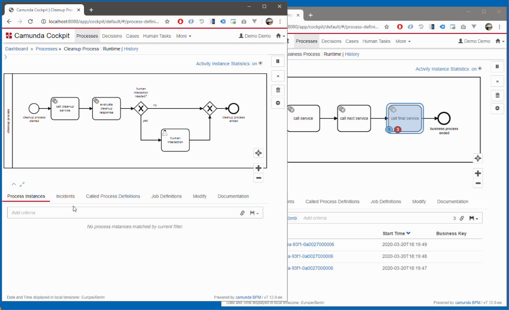

# Camunda Inter-Process-Token-Mover-Plugin (CIPTMP)
  
[](https://github.com/rnschk/camunda-inter-process-token-mover-plugin)
[](https://github.com/camunda/camunda-bpm-platform)
[](https://github.com/rnschk/camunda-inter-process-token-mover-plugin)
[](https://github.com/rnschk/camunda-inter-process-token-mover-plugin)
[](https://github.com/rnschk/camunda-inter-process-token-mover-plugin)
[](https://github.com/rnschk/camunda-inter-process-token-mover-plugin)
[](https://github.com/rnschk/camunda-inter-process-token-mover-plugin)
[](https://github.com/rnschk/camunda-inter-process-token-mover-plugin)

This plugin (CIPTMP) is a Camunda BPM extension that provides new opportunities for DevOps. With CIPTMP it is possible to switch executions between different business processes on-the-fly! Nothing more than drag'n'drop token-manipulation is needed (see below). Many users are excited after realising the oppertunites of CIPTMP.
The current verion was successfully tested with Camunda 7.16. Feel free to share your working setup to extend the list of possible combinations (see below). 

### Features
* Swtich execution from any process to another process in **real-time** simply by **drag 'n' drop**!
* Continue execution with **complete process-context** with all variables and even **history-data** in any other process.
* Plain-vanilla java implementation - no other dependencies needed! :nerd_face:
* User-management and access-rights: *Who is allowed to drag'n'drop tokens from __what__ process to __which other__ process?!*
* "*DevOps has been never such a piece of cake.* :cake:" (Anonymous user, 2020)
* "*Works like a charm - I love it!* :heart:" (Another user, 2020)

### CIPTMP in Action


### Upcoming Features
* **Multiplier**: Clone token into **several** business-processes at a time - not just one. :trident:
* **Automation**: Configure any activity in one process to toss tokens into another process completely automatic - or even scheduled e.g. during **host-opening-hours**!? :clock11: :wink:
* **The Magnet**: Collect all tokens from each process and every version into on single activity just with a snap of the finger. :clap:
* **Randy Random**: Bored of DevOps? Everything works perfectly? And there is **too little chaos**? Then feel free to shuffle all tokens at one by beaming them to some **random** activity into one of your processes. **That's not all**: Of course, the process-contexts will be randomized as well! :game_die: :trollface:
* **Last-but-not-least: Offline-token!!** Store any token on USB- or Floppy-drive and resume it at any other Camunda-engine around the world :globe_with_meridians: - whenever, whereever, whoever, 100% offline and encrypted, as often as you want! :v:  


### Getting started
* Download `CIPTMP` from the dealer of your trust, save it into the `WEB-INF/lib` folder of the Camunda webapp and restart server. Configuration can be done in `bpm-platform.xml`
```
<bpm-platform>
  <!-- ... --> 
  <CIPTMP>
    <configuration>
      <property name="enabled">true|false</property>
      <features>
        <property name="multiplier">true|false</property>
        <property name="randy-random">true|false</property>
        <property name="automation">true|false</property>
        <property name="magnet">true|false</property>
      </features>
    </configuration>
  </CIPTMP>
</bpm-platform>
```

### Tested Tnvironments:
* Camunda BPM 7.16+, Community/Enterprise
* Database: MySQL 5.6+, MariaDB 10.2+, Oracle 12c+, PostgreSql 9.4+, MS SQL 2012+, H2 1.4+, **ISAM** :floppy_disk:
* Application Server: Tomecat 7.0+, JBoss 6.4+, Wildfly 11.0+, and **z/OS 2.4+** :satellite:
* Browser: Google Chrome 43+, Mozilla Firefox 37+, Apple Safari and even **Internet Explorer 8+** :bug:

### Maintainer
* [](https://twitter.com/rnschk) 

### Contributors
* [rick](http://youtu.be/dQw4w9WgXcQ)

### License
* [MIT License](LICENSE)
